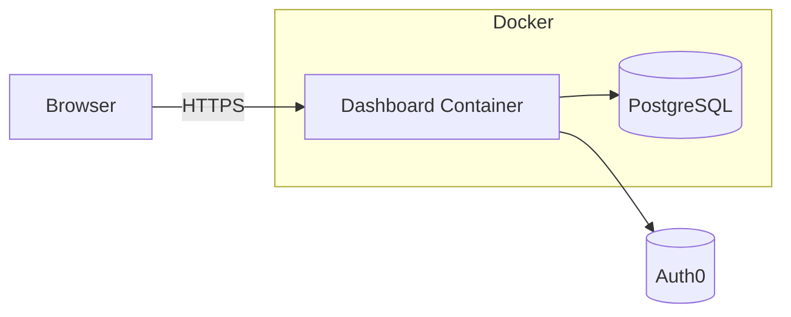

# Deployment Guide

This guide explains how to run the dashboard with Docker Compose and how to configure a production environment. It also outlines the contributor workflow.

## Docker Compose

1. Copy `.env.example` to `.env` and adjust any variables for your environment.
2. Place required secrets in the `secrets/` directory (see `docker-compose.yml`).
3. Start the services:
   ```bash
   docker-compose up -d
   ```
   The Compose file spins up the dashboard container and a PostgreSQL database.

## Production Configuration

Set `YOSAI_ENV=production` when deploying. The application will fail to start if `SECRET_KEY` or `DB_PASSWORD` contain placeholder values. Auth0 credentials must also be provided via Docker secrets or environment variables.

## Contributor Workflow

### Branching Strategy
- Create feature branches as `feature/<topic>` or `fix/<issue>`.
- Open a pull request against `main` when ready for review.

### Testing Requirements
- Run the full test suite with `pytest`.
- Ensure code passes type checks: `mypy .`.
- Verify formatting and style: `black . --check` and `flake8 .`.

### Code Style
- Follow PEP 8 and keep functions short and well documented.
- Use Black for automatic formatting and Flake8 for linting.

## Deployment Diagram



